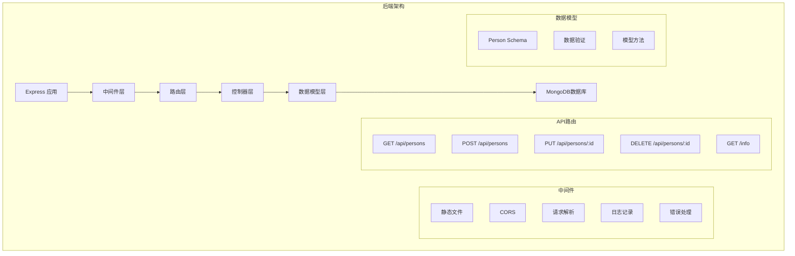

# Part 3: Node.js 后端开发

## 项目架构图



## 项目概述

这是一个使用 Node.js 和 Express 构建的 RESTful API 服务器，实现了一个简单的电话簿后端系统。项目展示了现代后端开发的核心概念和最佳实践。

## 技术栈

- **运行时**: Node.js
- **Web框架**: Express
- **数据库**: MongoDB
- **ODM**: Mongoose
- **开发工具**:
  - nodemon (开发热重载)
  - dotenv (环境变量管理)
  - ESLint (代码规范)
- **中间件**:
  - cors (跨域资源共享)
  - morgan (HTTP请求日志)
  - body-parser (请求体解析)

## 功能特性

1. **RESTful API**

   - 完整的 CRUD 操作支持
   - 标准的 HTTP 方法使用
   - 合理的状态码处理
2. **数据持久化**

   - MongoDB 数据存储
   - Mongoose 模型定义
   - 数据验证
3. **错误处理**

   - 集中式错误处理
   - 自定义错误中间件
   - 错误响应格式化
4. **中间件集成**

   - 请求日志记录
   - 跨域资源支持
   - 静态文件服务

## 代码结构

```
part_3/
├── index.js          # 应用入口点
├── models/           # 数据模型定义
│   └── person.js     # Person模型
├── build/            # 前端构建文件
├── mongo.js          # 数据库连接脚本
├── package.json      # 项目配置
└── .eslintrc.js      # ESLint配置
```

## API 端点

1. **GET /api/persons**

   - 获取所有联系人列表
   - 响应: 联系人数组
2. **GET /api/persons/:id**

   - 获取特定联系人
   - 参数: id
   - 响应: 单个联系人对象
3. **POST /api/persons**

   - 创建新联系人
   - 请求体: { name, number }
   - 响应: 创建的联系人对象
4. **PUT /api/persons/:id**

   - 更新联系人信息
   - 参数: id
   - 请求体: { name, number }
   - 响应: 更新后的联系人对象
5. **DELETE /api/persons/:id**

   - 删除联系人
   - 参数: id
   - 响应: 204 No Content

## 数据模型

```javascript
const personSchema = new mongoose.Schema({
    name: {
        type: String,
        minlength: 3,
        required: true,
        unique: true
    },
    number: {
        type: String,
        minlength: 8,
        required: true,
        unique: true
    }
});
```

## 错误处理

```javascript
const errorHandler = (error, request, response, next) => {
    if (error.name === "CastError") {
        return response.status(400).send({ error: "malformatted id" });
    } else if (error.name === "ValidationError") {
        return response.status(400).json({ error: error.message });
    }
    next(error);
};
```

## 技术债务与改进

1. **架构改进**

   - 实现控制器层分离
   - 添加服务层
   - 实现依赖注入
   - 使用仓储模式
2. **安全性**

   - 添加请求速率限制
   - 实现请求验证
   - 添加安全头部
   - 实现认证授权
3. **性能优化**

   - 实现数据缓存
   - 优化数据库查询
   - 添加数据库索引
   - 实现连接池
4. **可维护性**

   - 迁移到 TypeScript
   - 添加单元测试
   - 实现API文档
   - 添加日志系统
5. **部署优化**

   - 容器化应用
   - 实现CI/CD
   - 添加健康检查
   - 实现监控系统

## 现代化改进建议

1. **框架升级**

   ```javascript
   // 使用 Express 替代方案
   import Fastify from 'fastify'
   import { TypeBoxTypeProvider } from '@fastify/type-provider-typebox'
   ```
2. **数据验证**

   ```javascript
   // 使用 JSON Schema 验证
   const schema = {
     body: Type.Object({
       name: Type.String({ minLength: 3 }),
       number: Type.String({ minLength: 8 })
     })
   }
   ```
3. **API文档**

   ```javascript
   // 使用 OpenAPI 规范
   app.register(require('@fastify/swagger'), {
     openapi: {
       info: {
         title: 'Phone Book API',
         version: '1.0.0'
       }
     }
   })
   ```
4. **缓存实现**

   ```javascript
   // 使用 Redis 缓存
   const cache = await createClient()
   app.register(require('@fastify/redis'), { client: cache })
   ```

## 部署说明

1. **环境要求**

   - Node.js 14+
   - MongoDB 4+
   - 环境变量配置
2. **安装步骤**

   ```bash
   # 安装依赖
   npm install

   # 开发环境运行
   npm run dev

   # 生产环境构建
   npm run build
   npm start
   ```
3. **环境变量**

   ```
   MONGODB_URI=mongodb://localhost/phonebook
   PORT=3001
   ```

## 测试策略

1. **单元测试**

   - 模型验证测试
   - 控制器逻辑测试
   - 中间件测试
2. **集成测试**

   - API端点测试
   - 数据库操作测试
   - 错误处理测试
3. **性能测试**

   - 负载测试
   - 压力测试
   - 并发测试

## 监控与日志

1. **应用监控**

   - 性能指标
   - 错误追踪
   - 资源使用
2. **日志记录**

   - 请求日志
   - 错误日志
   - 审计日志

## 安全考虑

1. **输入验证**

   - 请求数据验证
   - SQL注入防护
   - XSS防护
2. **认证授权**

   - JWT实现
   - 角色权限
   - 会话管理
3. **安全配置**

   - CORS策略
   - 安全头部
   - 速率限制

## Sovelluksen osoite Herokussa

https://pure-falls-78176.herokuapp.com/

## Päivitetty frontend löytyy GitHubista:

https://github.com/villeheikkila/fullstack
