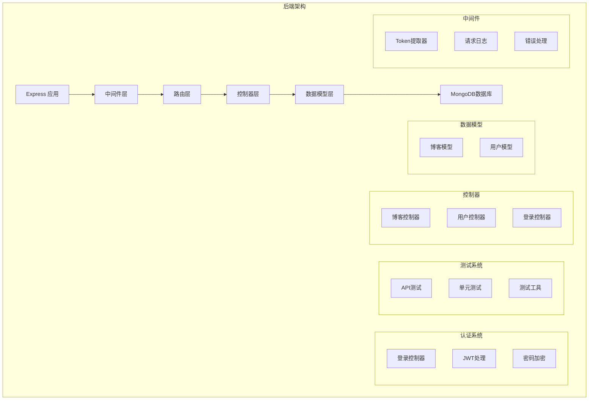

# Part 4: 测试与用户认证

## 项目架构图



## 项目概述

这是一个带有完整测试和用户认证的博客后端系统，展示了现代后端开发中的测试实践和安全认证实现。

## 技术栈

- **核心框架**:

  - Node.js
  - Express
  - MongoDB + Mongoose
- **测试工具**:

  - Jest
  - Supertest
  - Cross-env
- **安全认证**:

  - JWT
  - Bcrypt
  - Passport
- **开发工具**:

  - ESLint
  - Nodemon
  - dotenv

## 项目结构

```
part_4/
├── controllers/        # 控制器
│   ├── blogs.js       # 博客相关操作
│   ├── users.js       # 用户管理
│   └── login.js       # 认证处理
├── models/            # 数据模型
│   ├── blog.js        # 博客模型
│   └── user.js        # 用户模型
├── tests/             # 测试文件
│   ├── blogs_api.test.js
│   ├── users_api.test.js
│   └── helpers/
├── utils/             # 工具函数
├── app.js             # 应用配置
└── index.js           # 入口文件
```

## 功能特性

1. **用户认证**

   - JWT基础认证
   - 密码加密存储
   - Token验证
2. **博客管理**

   - CRUD操作
   - 用户关联
   - 权限控制
3. **测试覆盖**

   - API测试
   - 单元测试
   - 辅助函数测试
4. **错误处理**

   - 集中式错误处理
   - 验证错误处理
   - 异步错误捕获

## API 端点

### 博客相关

```javascript
// 博客API
GET /api/blogs          // 获取所有博客
POST /api/blogs         // 创建新博客
DELETE /api/blogs/:id   // 删除博客
PUT /api/blogs/:id      // 更新博客

// 用户API
POST /api/users         // 创建用户
GET /api/users          // 获取用户列表

// 认证API
POST /api/login         // 用户登录
```

## 数据模型

### 博客模型

```javascript
const blogSchema = new mongoose.Schema({
  title: String,
  author: String,
  url: String,
  likes: Number,
  user: {
    type: mongoose.Schema.Types.ObjectId,
    ref: 'User'
  }
})
```

### 用户模型

```javascript
const userSchema = new mongoose.Schema({
  username: {
    type: String,
    required: true,
    unique: true
  },
  name: String,
  passwordHash: String,
  blogs: [
    {
      type: mongoose.Schema.Types.ObjectId,
      ref: 'Blog'
    }
  ]
})
```

## 测试实现

### API测试

```javascript
describe('blog api tests', () => {
  test('blogs are returned as json', async () => {
    await api
      .get('/api/blogs')
      .expect(200)
      .expect('Content-Type', /application\/json/)
  })
})
```

### 单元测试

```javascript
describe('total likes', () => {
  test('when list has only one blog equals the likes of that', () => {
    const result = listHelper.totalLikes(listWithOneBlog)
    expect(result).toBe(5)
  })
})
```

## 认证流程

1. **用户注册**

   ```javascript
   const saltRounds = 10
   const passwordHash = await bcrypt.hash(password, saltRounds)
   ```
2. **用户登录**

   ```javascript
   const token = jwt.sign(userForToken, process.env.SECRET)
   ```
3. **Token验证**

   ```javascript
   const decodedToken = jwt.verify(token, process.env.SECRET)
   ```

## 错误处理

```javascript
const errorHandler = (error, request, response, next) => {
  if (error.name === 'CastError') {
    return response.status(400).send({ error: 'malformatted id' })
  } else if (error.name === 'ValidationError') {
    return response.status(400).json({ error: error.message })
  } else if (error.name === 'JsonWebTokenError') {
    return response.status(401).json({ error: 'invalid token' })
  }
  next(error)
}
```

## 技术债务与改进

1. **架构优化**

   - 实现依赖注入
   - 添加服务层
   - 实现仓储模式
   - 使用接口抽象
2. **测试改进**

   - 添加E2E测试
   - 提高测试覆盖率
   - 实现性能测试
   - 添加快照测试
3. **安全加强**

   - 实现刷新令牌
   - 添加请求限流
   - 实现2FA认证
   - 加强密码策略
4. **性能优化**

   - 实现缓存层
   - 优化数据库查询
   - 添加数据库索引
   - 实现数据分页

## 现代化改进建议

1. **TypeScript迁移**

   ```typescript
   interface Blog {
     title: string;
     author: string;
     url: string;
     likes: number;
     user: Types.ObjectId;
   }
   ```
2. **测试框架升级**

   ```javascript
   import { describe, it, expect } from 'vitest'
   ```
3. **API文档自动化**

   ```javascript
   import { SwaggerModule, DocumentBuilder } from '@nestjs/swagger'
   ```
4. **监控集成**

   ```javascript
   import { PrometheusExporter } from '@opentelemetry/exporter-prometheus'
   ```

## 部署说明

1. **环境变量**

   ```
   MONGODB_URI=mongodb://localhost/bloglist
   PORT=3003
   SECRET=your_jwt_secret
   ```
2. **运行测试**

   ```bash
   npm run test
   npm run test:coverage
   ```
3. **生产部署**

   ```bash
   npm run build
   npm start
   ```

## 最佳实践

1. **测试原则**

   - 编写独立测试
   - 使用测试数据库
   - 清理测试数据
   - 模拟外部服务
2. **安全原则**

   - 验证所有输入
   - 加密敏感数据
   - 实现速率限制
   - 使用安全头部
3. **代码质量**

   - 遵循ESLint规则
   - 编写API文档
   - 实现错误处理
   - 添加日志记录

## 监控与日志

1. **应用监控**

   - 请求计数
   - 响应时间
   - 错误率
   - 资源使用
2. **安全监控**

   - 登录尝试
   - Token使用
   - API访问
   - 异常行为
3. **性能监控**

   - 数据库查询
   - 内存使用
   - CPU负载
   - 并发连接
