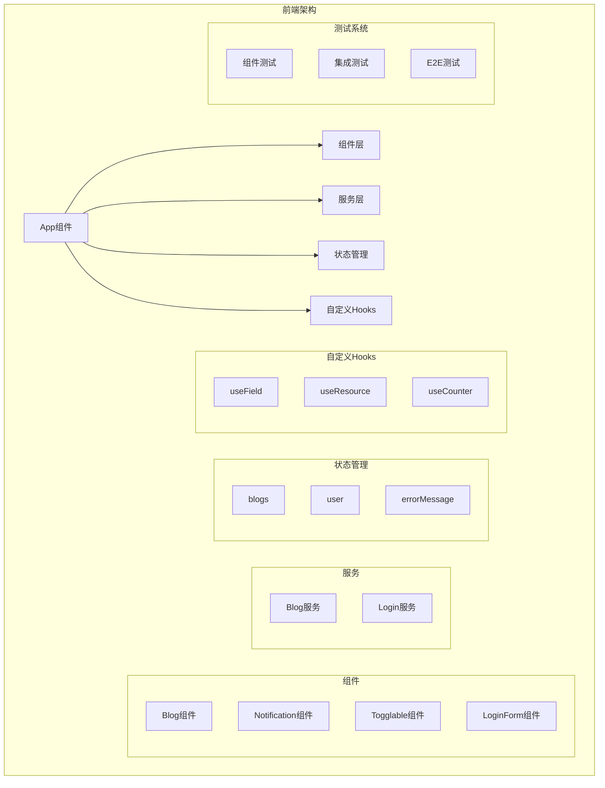

# Part 5: 前端测试与自定义Hooks

## 项目架构图



## 项目概述

Part 5 包含三个主要项目：

1. 博客列表前端 - 完整的React应用
2. 博客列表后端 - 配套的Node.js后端
3. 自定义Hooks - React Hooks最佳实践

## 技术栈

### 前端技术

- React (Hooks & 函数组件)
- Jest & React Testing Library
- Cypress (E2E测试)
- Axios (HTTP客户端)
- CSS Modules

### 后端技术

- Node.js & Express
- MongoDB & Mongoose
- JWT认证
- Jest (API测试)

### 开发工具

- Create React App
- ESLint
- Prettier
- PropTypes

## 项目结构

```
part_5/
├── bloglist-frontend/     # 博客列表前端
│   ├── src/
│   │   ├── components/    # React组件
│   │   ├── services/      # API服务
│   │   ├── hooks/         # 自定义Hooks
│   │   └── App.js         # 主应用
├── bloglist-backend/      # 博客列表后端
│   ├── controllers/       # 路由控制器
│   ├── models/           # 数据模型
│   └── tests/            # API测试
└── custom-hooks/         # Hooks练习项目
    └── src/
        └── hooks/        # 自定义Hook实现
```

## 功能特性

### 1. 博客列表应用

#### 核心功能

- 用户认证
- 博客管理
- 点赞功能
- 评论系统

#### 技术实现

```javascript
const App = () => {
  const [blogs, setBlogs] = useState([])
  const [user, setUser] = useState(null)
  const [errorMessage, setErrorMessage] = useState(null)

  // 自定义Hook使用
  const username = useField('text')
  const password = useField('password')

  // 认证逻辑
  const handleLogin = async (event) => {
    // ... 登录实现
  }

  // 博客管理
  const addBlog = async (event) => {
    // ... 添加博客
  }
}
```

### 2. 自定义Hooks

#### useField Hook

```javascript
const useField = (type) => {
  const [value, setValue] = useState('')

  const onChange = (event) => {
    setValue(event.target.value)
  }

  return {
    type,
    value,
    onChange
  }
}
```

#### useResource Hook

```javascript
const useResource = (baseUrl) => {
  const [resources, setResources] = useState([])

  // CRUD 操作实现
  const create = async (resource) => {
    // ... 创建资源
  }

  const update = async (id, resource) => {
    // ... 更新资源
  }

  return [resources, { create, update }]
}
```

## 测试实现

### 组件测试

```javascript
describe('<Blog />', () => {
  test('renders content', () => {
    const blog = {
      title: 'Component testing',
      author: 'Test Author'
    }

    const component = render(<Blog blog={blog} />)
    expect(component.container).toHaveTextContent('Component testing')
  })
})
```

### 集成测试

```javascript
describe('Blog app', () => {
  beforeEach(() => {
    // 测试数据库设置
  })

  test('login form is shown', () => {
    const component = render(<App />)
    expect(component.container).toHaveTextContent('log in')
  })
})
```

### E2E测试

```javascript
describe('Blog app', function() {
  it('front page can be opened', function() {
    cy.visit('http://localhost:3000')
    cy.contains('blogs')
  })
})
```

## 技术债务与改进

1. **状态管理**

   - 当前：React useState
   - 建议：Redux Toolkit/Zustand
   - 原因：更好的状态管理
2. **类型系统**

   - 当前：PropTypes
   - 建议：TypeScript
   - 原因：更好的类型安全
3. **测试覆盖**

   - 当前：基础测试
   - 建议：增加测试覆盖率
   - 原因：提高代码质量
4. **性能优化**

   - 当前：基础优化
   - 建议：React.memo, useMemo
   - 原因：提升性能

## 现代化改进建议

1. **组件改进**

```typescript
interface BlogProps {
  blog: Blog;
  user: User;
  onLike: (blog: Blog) => void;
}

const Blog: React.FC<BlogProps> = ({ blog, user, onLike }) => {
  // 实现
}
```

2. **Hook改进**

```typescript
interface UseFieldOptions {
  type: string;
  initialValue?: string;
  validate?: (value: string) => boolean;
}

const useField = ({ type, initialValue = '', validate }: UseFieldOptions) => {
  // 实现
}
```

3. **测试改进**

```typescript
import { renderHook, act } from '@testing-library/react-hooks'

test('useField hook', () => {
  const { result } = renderHook(() => useField({ type: 'text' }))
  act(() => {
    result.current.onChange({ target: { value: 'test' } })
  })
  expect(result.current.value).toBe('test')
})
```

## 部署说明

1. **环境配置**

```bash
# 前端
REACT_APP_API_URL=http://localhost:3001/api

# 后端
MONGODB_URI=mongodb://localhost/bloglist
JWT_SECRET=your_jwt_secret
```

2. **开发环境**

```bash
# 前端
npm start
npm test

# 后端
npm run dev
npm run test
```

3. **生产环境**

```bash
# 前端构建
npm run build

# 后端部署
npm start
```

## 最佳实践

1. **组件设计**

   - 单一职责原则
   - 组件复用
   - Props验证
   - 错误边界
2. **Hook使用**

   - 遵循Hook规则
   - 抽象共用逻辑
   - 性能考虑
   - 依赖管理
3. **测试策略**

   - 组件隔离测试
   - 用户交互测试
   - 集成测试
   - E2E测试
4. **性能优化**

   - 组件拆分
   - 状态本地化
   - 缓存计算结果
   - 延迟加载

## 安全考虑

1. **前端安全**

   - XSS防护
   - CSRF防护
   - 安全的状态管理
   - 输入验证
2. **API安全**

   - Token验证
   - 请求限流
   - 错误处理
   - CORS配置
