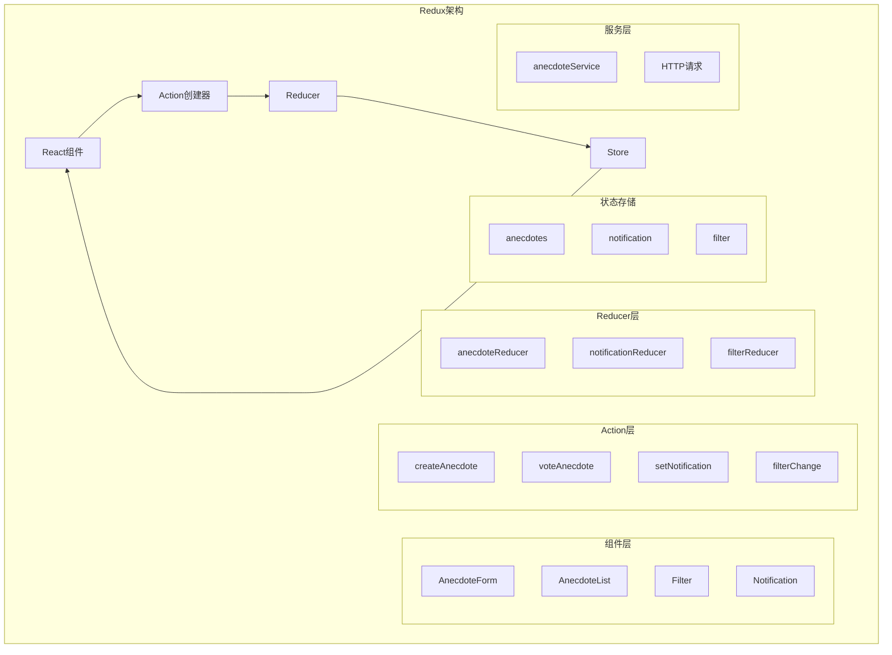

# Part 6: Redux 状态管理

## 项目架构图



## 项目概述

Part 6 包含两个Redux状态管理的练习项目：

1. unicafe-redux - Redux基础实现
2. redux-anecdotes - Redux完整应用

## 技术栈

### 核心技术

- React
- Redux
- Redux Thunk
- Axios
- JSON Server

### 开发工具

- Create React App
- Redux DevTools
- Jest
- ESLint

## 项目结构

```
part_6/
├── unicafe-redux/         # Redux基础练习
│   └── src/
│       ├── reducer.js     # Redux reducer
│       └── index.js       # 应用入口
└── redux-anecdotes/       # Redux完整应用
    └── src/
        ├── components/    # React组件
        ├── reducers/      # Redux reducers
        ├── services/      # API服务
        └── store.js       # Redux store配置
```

## 功能实现

### 1. Redux基础 (unicafe-redux)

#### Reducer实现

```javascript
const counterReducer = (state = initialState, action) => {
  switch (action.type) {
    case 'GOOD':
      return { ...state, good: state.good + 1 }
    case 'OK':
      return { ...state, ok: state.ok + 1 }
    case 'BAD':
      return { ...state, bad: state.bad + 1 }
    case 'ZERO':
      return initialState
    default:
      return state
  }
}
```

#### 状态管理

```javascript
const store = createStore(counterReducer)

// Action分发
store.dispatch({ type: 'GOOD' })
store.dispatch({ type: 'OK' })
store.dispatch({ type: 'BAD' })
```

### 2. Redux进阶 (redux-anecdotes)

#### Action Creator

```javascript
export const createAnecdote = (content) => {
  return async dispatch => {
    const newAnecdote = await anecdotesService.create(content)
    dispatch({
      type: 'NEW_ANECDOTE',
      data: newAnecdote
    })
  }
}
```

#### Reducer实现

```javascript
const anecdoteReducer = (state = [], action) => {
  switch (action.type) {
    case 'VOTE':
      const id = action.data.id
      return state.map(anecdote =>
        anecdote.id !== id ? anecdote : action.data
      )
    case 'NEW_ANECDOTE':
      return [...state, action.data]
    case 'INIT_ANECDOTES':
      return action.data
    default:
      return state
  }
}
```

#### 异步Action

```javascript
export const initializeAnecdotes = () => {
  return async dispatch => {
    const anecdotes = await anecdotesService.getAll()
    dispatch({
      type: 'INIT_ANECDOTES',
      data: anecdotes,
    })
  }
}
```

## 状态管理模式

### 1. Action类型

```javascript
// 同步Action
const simpleAction = {
  type: 'SIMPLE_ACTION',
  data: payload
}

// 异步Action (Thunk)
const asyncAction = () => {
  return async dispatch => {
    const data = await service.getData()
    dispatch({
      type: 'ASYNC_ACTION',
      data
    })
  }
}
```

### 2. Store配置

```javascript
import { createStore, combineReducers, applyMiddleware } from 'redux'
import thunk from 'redux-thunk'
import { composeWithDevTools } from 'redux-devtools-extension'

const reducer = combineReducers({
  anecdotes: anecdoteReducer,
  notification: notificationReducer
})

const store = createStore(
  reducer,
  composeWithDevTools(
    applyMiddleware(thunk)
  )
)
```

## 技术债务与改进

1. **状态管理**

   - 当前：Redux + Thunk
   - 建议：Redux Toolkit
   - 原因：简化样板代码
2. **类型系统**

   - 当前：JavaScript
   - 建议：TypeScript
   - 原因：类型安全
3. **性能优化**

   - 当前：基础实现
   - 建议：选择性渲染
   - 原因：避免不必要的重渲染
4. **测试覆盖**

   - 当前：基础测试
   - 建议：完整测试套件
   - 原因：保证可靠性

## 现代化改进建议

1. **Redux Toolkit迁移**

```javascript
import { createSlice } from '@reduxjs/toolkit'

const anecdoteSlice = createSlice({
  name: 'anecdotes',
  initialState: [],
  reducers: {
    createAnecdote(state, action) {
      state.push(action.payload)
    },
    voteAnecdote(state, action) {
      const id = action.payload
      const anecdote = state.find(a => a.id === id)
      anecdote.votes += 1
    }
  }
})
```

2. **TypeScript支持**

```typescript
interface Anecdote {
  id: string;
  content: string;
  votes: number;
}

interface RootState {
  anecdotes: Anecdote[];
  notification: string | null;
}
```

3. **性能优化**

```javascript
import { createSelector } from '@reduxjs/toolkit'

const selectAnecdotes = state => state.anecdotes
const selectFilter = state => state.filter

export const selectFilteredAnecdotes = createSelector(
  [selectAnecdotes, selectFilter],
  (anecdotes, filter) => {
    // 记忆化选择器
  }
)
```

## 最佳实践

1. **Action设计**

   - 使用Action Creator
   - 实现异步Action
   - 保持Action简单
   - 使用常量定义类型
2. **Reducer实现**

   - 保持纯函数
   - 避免副作用
   - 使用不可变更新
   - 合理拆分reducer
3. **状态设计**

   - 扁平化状态
   - 规范化数据
   - 避免冗余
   - 合理的状态粒度
4. **性能考虑**

   - 选择性渲染
   - 记忆化选择器
   - 避免过度订阅
   - 优化dispatch频率

## 测试策略

1. **Reducer测试**

```javascript
describe('anecdoteReducer', () => {
  test('returns new state with action NEW_ANECDOTE', () => {
    const state = []
    const action = {
      type: 'NEW_ANECDOTE',
      data: 'test anecdote'
    }
    const newState = anecdoteReducer(state, action)
    expect(newState).toHaveLength(1)
  })
})
```

2. **Action Creator测试**

```javascript
describe('createAnecdote', () => {
  test('dispatches NEW_ANECDOTE with correct payload', async () => {
    const dispatch = jest.fn()
    await createAnecdote('test')(dispatch)
    expect(dispatch).toHaveBeenCalledWith({
      type: 'NEW_ANECDOTE',
      data: expect.any(Object)
    })
  })
})
```

## 部署说明

1. **开发环境**

```bash
# 启动开发服务器
npm start

# 启动JSON Server
npm run server

# 运行测试
npm test
```

2. **生产环境**

```bash
# 构建生产版本
npm run build

# 运行生产服务器
serve -s build
```

## 注意事项

1. **状态设计**

   - 合理的状态结构
   - 避免状态冗余
   - 考虑性能影响
2. **异步处理**

   - 使用Redux Thunk
   - 错误处理
   - 加载状态
3. **性能优化**

   - 选择性渲染
   - 记忆化选择器
   - 合理的更新策略
