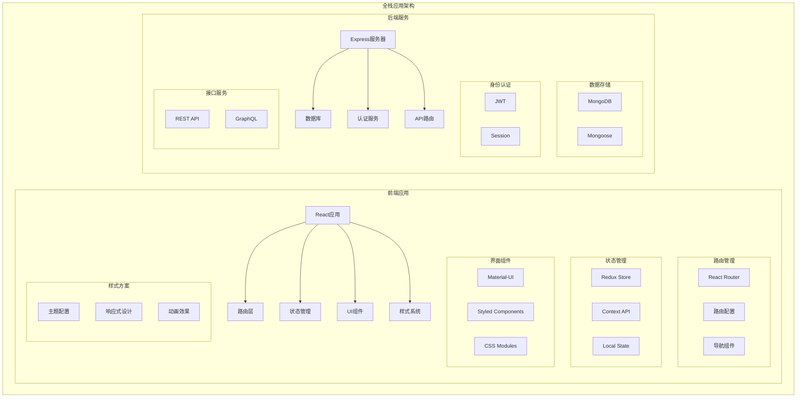

# Part 7: React Router、自定义 Hooks 与样式库

## 项目架构图



## 项目概述

Part 7 包含三个主要项目：

1. **routed-anecdotes**: 使用React Router实现的趣闻轶事应用
2. **bloglist-frontend**: 使用现代前端技术栈的博客列表应用
3. **bloglist-backend**: 配套的后端服务实现

## 技术栈

### 前端技术
- React 18
- React Router 6
- Redux/Context API
- Material-UI/Styled Components
- Webpack 5
- Axios

### 后端技术
- Node.js
- Express
- MongoDB
- Mongoose
- JWT认证

### 开发工具
- ESLint
- Prettier
- Jest
- React Testing Library
- Cypress

## 项目结构

```
part_7/
├── routed-anecdotes/        # 路由示例项目
│   ├── src/
│   │   ├── App.js          # 主应用
│   │   ├── components/     # 组件目录
│   │   └── hooks/         # 自定义Hooks
│   
├── bloglist-frontend/      # 博客前端
│   ├── src/
│   │   ├── components/    # React组件
│   │   ├── reducers/     # Redux reducers
│   │   ├── services/     # API服务
│   │   └── styles/       # 样式文件
│   
└── bloglist-backend/      # 博客后端
    ├── controllers/       # 控制器
    ├── models/           # 数据模型
    ├── utils/            # 工具函数
    └── tests/            # 测试文件
```

## 功能实现

### 1. Routed Anecdotes

#### 路由配置
```javascript
const Router = () => {
  return (
    <Routes>
      <Route path="/" element={<AnecdoteList />} />
      <Route path="/create" element={<CreateNew />} />
      <Route path="/about" element={<About />} />
      <Route path="/anecdotes/:id" element={<Anecdote />} />
    </Routes>
  )
}
```

#### 导航实现
```javascript
const Navigation = () => {
  return (
    <nav>
      <Link to="/">anecdotes</Link>
      <Link to="/create">create new</Link>
      <Link to="/about">about</Link>
    </nav>
  )
}
```

### 2. Blog List Frontend

#### Material-UI主题
```javascript
const theme = createTheme({
  palette: {
    primary: {
      main: '#556cd6',
    },
    secondary: {
      main: '#19857b',
    },
  },
})
```

#### Styled Components
```javascript
const Button = styled.button`
  background: ${props => props.primary ? "palevioletred" : "white"};
  color: ${props => props.primary ? "white" : "palevioletred"};
  font-size: 1em;
  margin: 1em;
  padding: 0.25em 1em;
  border: 2px solid palevioletred;
  border-radius: 3px;
`
```

### 3. Blog List Backend

#### API实现
```javascript
blogsRouter.get('/', async (request, response) => {
  const blogs = await Blog
    .find({})
    .populate('user', { username: 1, name: 1 })
  response.json(blogs)
})
```

## 路由设计

### 1. 基础路由
- `/` - 首页
- `/blogs` - 博客列表
- `/blogs/:id` - 博客详情
- `/users` - 用户列表
- `/login` - 登录页面

### 2. 嵌套路由
```javascript
<Routes>
  <Route path="/" element={<Layout />}>
    <Route index element={<Home />} />
    <Route path="blogs" element={<Blogs />}>
      <Route path=":id" element={<Blog />} />
    </Route>
    <Route path="users" element={<Users />} />
  </Route>
</Routes>
```

## 样式方案

### 1. Material-UI集成
```javascript
import { ThemeProvider } from '@mui/material/styles'
import CssBaseline from '@mui/material/CssBaseline'

function App() {
  return (
    <ThemeProvider theme={theme}>
      <CssBaseline />
      <Router />
    </ThemeProvider>
  )
}
```

### 2. 响应式设计
```javascript
const ResponsiveContainer = styled.div`
  @media (max-width: 768px) {
    flex-direction: column;
  }
  display: flex;
  flex-wrap: wrap;
`
```

## 状态管理

### 1. Redux Store
```javascript
const store = configureStore({
  reducer: {
    blogs: blogsReducer,
    user: userReducer,
    notification: notificationReducer
  }
})
```

### 2. Context API
```javascript
const NotificationContext = createContext()

export const NotificationProvider = ({ children }) => {
  const [notification, setNotification] = useState(null)
  
  return (
    <NotificationContext.Provider value={[notification, setNotification]}>
      {children}
    </NotificationContext.Provider>
  )
}
```

## 技术债务与改进

1. **前端优化**
   - 实现代码分割
   - 添加性能监控
   - 优化打包大小
   - 实现PWA支持

2. **后端改进**
   - 添加缓存层
   - 实现数据分页
   - 优化查询性能
   - 添加实时功能

3. **测试覆盖**
   - 增加E2E测试
   - 添加性能测试
   - 实现快照测试
   - 提高测试覆盖率

## 现代化改进建议

1. **Next.js迁移**
```javascript
// pages/blogs/[id].js
export async function getStaticProps({ params }) {
  const blog = await getBlogById(params.id)
  return {
    props: { blog }
  }
}
```

2. **GraphQL集成**
```javascript
const GET_BLOGS = gql`
  query GetBlogs {
    blogs {
      id
      title
      author
      url
      likes
    }
  }
`
```

3. **Typescript支持**
```typescript
interface Blog {
  id: string;
  title: string;
  author: string;
  url: string;
  likes: number;
  user: User;
}
```

## 部署说明

1. **开发环境**
```bash
# 前端开发
cd bloglist-frontend
npm install
npm start

# 后端开发
cd bloglist-backend
npm install
npm run dev
```

2. **生产环境**
```bash
# 前端构建
npm run build

# 后端部署
npm start
```

## 最佳实践

1. **路由设计**
   - 使用动态路由
   - 实现路由守卫
   - 处理404页面
   - 优化导航体验

2. **样式管理**
   - 主题配置
   - 样式模块化
   - 响应式设计
   - 动画效果

3. **状态管理**
   - 合理使用Redux
   - 本地状态管理
   - 状态持久化
   - 性能优化

4. **API集成**
   - 请求封装
   - 错误处理
   - 缓存策略
   - 加载状态

## 注意事项

1. **性能考虑**
   - 路由懒加载
   - 组件优化
   - 缓存管理
   - 资源优化

2. **安全措施**
   - 认证授权
   - XSS防护
   - CSRF防护
   - 输入验证

3. **用户体验**
   - 加载反馈
   - 错误提示
   - 响应式设计
   - 无障碍支持 