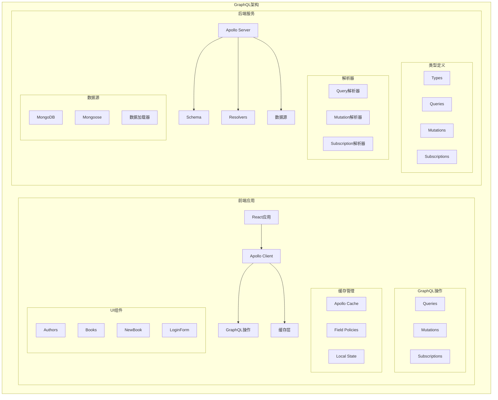

# Part 8: GraphQL

## 项目架构图



## 项目概述

Part 8 包含一个完整的GraphQL图书馆应用，分为：

1. **library-backend**: GraphQL后端服务
2. **library-frontend**: Apollo Client前端应用

## 技术栈

### 前端技术

- React
- Apollo Client
- GraphQL
- Material-UI
- JWT认证

### 后端技术

- Node.js
- Apollo Server
- MongoDB
- Mongoose
- GraphQL
- DataLoader

### 开发工具

- GraphQL Playground
- ESLint
- Jest
- Apollo Studio

## 项目结构

```
part_8/
├── library-frontend/       # 前端应用
│   ├── src/
│   │   ├── components/    # React组件
│   │   ├── queries/       # GraphQL查询
│   │   ├── mutations/     # GraphQL变更
│   │   └── App.js         # 主应用
│   
└── library-backend/       # 后端服务
    ├── schema.js         # GraphQL Schema
    ├── resolvers.js      # 解析器
    ├── models/          # 数据模型
    └── index.js         # 服务入口
```

## GraphQL Schema

### 类型定义

```graphql
type Book {
  title: String!
  author: Author!
  published: Int!
  genres: [String!]!
  id: ID!
}

type Author {
  name: String!
  born: Int
  bookCount: Int!
  id: ID!
}

type User {
  username: String!
  favoriteGenre: String!
  id: ID!
}

type Token {
  value: String!
}
```

### 查询定义

```graphql
type Query {
  bookCount: Int!
  authorCount: Int!
  allBooks(author: String, genre: String): [Book!]!
  allAuthors: [Author!]!
  me: User
}
```

### 变更定义

```graphql
type Mutation {
  addBook(
    title: String!
    author: String!
    published: Int!
    genres: [String!]!
  ): Book
  editAuthor(
    name: String!
    setBornTo: Int!
  ): Author
  createUser(
    username: String!
    favoriteGenre: String!
  ): User
  login(
    username: String!
    password: String!
  ): Token
}
```

### 订阅定义

```graphql
type Subscription {
  bookAdded: Book!
}
```

## 后端实现

### Apollo Server设置

```javascript
const server = new ApolloServer({
  typeDefs,
  resolvers,
  context: async ({ req }) => {
    const auth = req ? req.headers.authorization : null
    if (auth && auth.toLowerCase().startsWith('bearer ')) {
      const decodedToken = jwt.verify(
        auth.substring(7), process.env.JWT_SECRET
      )
      const currentUser = await User.findById(decodedToken.id)
      return { currentUser }
    }
  }
})
```

### 解析器实现

```javascript
const resolvers = {
  Query: {
    bookCount: () => Book.collection.countDocuments(),
    authorCount: () => Author.collection.countDocuments(),
    allBooks: async (root, args) => {
      // 图书查询逻辑
    },
    allAuthors: async () => {
      // 作者查询逻辑
    },
    me: (root, args, context) => {
      return context.currentUser
    }
  },
  
  Mutation: {
    addBook: async (root, args, context) => {
      // 添加图书逻辑
    },
    editAuthor: async (root, args, context) => {
      // 编辑作者逻辑
    }
  },
  
  Subscription: {
    bookAdded: {
      subscribe: () => pubsub.asyncIterator(['BOOK_ADDED'])
    }
  }
}
```

## 前端实现

### Apollo Client配置

```javascript
const client = new ApolloClient({
  uri: 'http://localhost:4000',
  cache: new InMemoryCache(),
  link: authLink.concat(httpLink)
})
```

### 查询实现

```javascript
const ALL_BOOKS = gql`
  query {
    allBooks {
      title
      author {
        name
      }
      published
      genres
    }
  }
`

const Books = () => {
  const result = useQuery(ALL_BOOKS)
  
  if (result.loading) {
    return <div>loading...</div>
  }
  
  return (
    // 渲染图书列表
  )
}
```

### 变更实现

```javascript
const ADD_BOOK = gql`
  mutation addBook($title: String!, $author: String!, $published: Int!, $genres: [String!]!) {
    addBook(
      title: $title,
      author: $author,
      published: $published,
      genres: $genres
    ) {
      title
      author {
        name
      }
    }
  }
`

const NewBook = () => {
  const [addBook] = useMutation(ADD_BOOK, {
    refetchQueries: [ { query: ALL_BOOKS } ]
  })
  
  // 表单处理逻辑
}
```

### 订阅实现

```javascript
const BOOK_ADDED = gql`
  subscription {
    bookAdded {
      title
      author {
        name
      }
    }
  }
`

useSubscription(BOOK_ADDED, {
  onSubscriptionData: ({ subscriptionData }) => {
    const addedBook = subscriptionData.data.bookAdded
    notify(`${addedBook.title} added`)
  
    // 更新缓存
    client.cache.modify({
      fields: {
        allBooks(existingBooks = []) {
          const newBookRef = client.cache.writeFragment({
            data: addedBook,
            fragment: gql`
              fragment NewBook on Book {
                title
                author {
                  name
                }
              }
            `
          })
          return [...existingBooks, newBookRef]
        }
      }
    })
  }
})
```

## 性能优化

### 1. DataLoader实现

```javascript
const DataLoader = require('dataloader')

const authorLoader = new DataLoader(async (authorIds) => {
  const authors = await Author.find({ _id: { $in: authorIds } })
  return authorIds.map(id => authors.find(author => author.id === id))
})
```

### 2. 缓存策略

```javascript
const cache = new InMemoryCache({
  typePolicies: {
    Query: {
      fields: {
        allBooks: {
          merge(existing = [], incoming) {
            return [...existing, ...incoming]
          }
        }
      }
    }
  }
})
```

## 技术债务与改进

1. **性能优化**

   - 实现分页
   - 优化N+1查询
   - 添加缓存层
   - 批量数据加载
2. **架构改进**

   - 模块化Schema
   - 自动化测试
   - 错误处理
   - 日志系统
3. **功能扩展**

   - 高级搜索
   - 实时更新
   - 文件上传
   - 权限系统

## 最佳实践

1. **Schema设计**

   - 类型复用
   - 接口抽象
   - 清晰的命名
   - 版本控制
2. **解析器实现**

   - 职责单一
   - 错误处理
   - 性能优化
   - 代码复用
3. **前端集成**

   - 优化请求
   - 状态管理
   - 错误处理
   - 用户体验

## 部署说明

1. **开发环境**

```bash
# 后端服务
cd library-backend
npm install
npm run dev

# 前端应用
cd library-frontend
npm install
npm start
```

2. **生产环境**

```bash
# 后端部署
npm run build
npm start

# 前端部署
npm run build
serve -s build
```

## 注意事项

1. **安全考虑**

   - 认证授权
   - 输入验证
   - 速率限制
   - CORS配置
2. **性能考虑**

   - 查询复杂度
   - 缓存策略
   - 批量操作
   - 数据加载
3. **可维护性**

   - 代码组织
   - 文档完善
   - 测试覆盖
   - 监控告警
