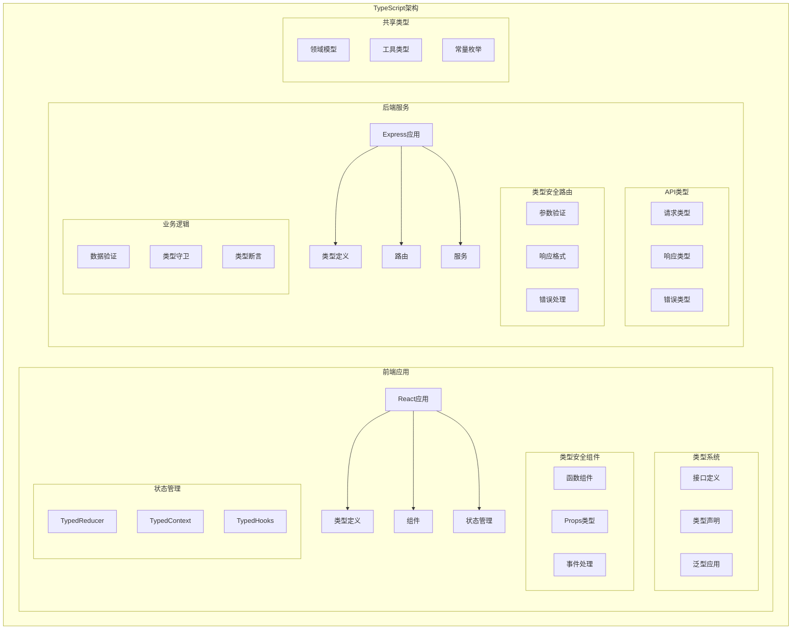

# Part 9: TypeScript

## 项目架构图



## 项目概述

Part 9 包含三个TypeScript项目：

1. **exercises_9.1-9.7**: TypeScript基础练习
2. **patientor-backend**: 医疗记录系统后端
3. **react-exercises**: React与TypeScript结合练习

## 技术栈

### 前端技术

- React
- TypeScript
- Material-UI
- React Router
- Formik

### 后端技术

- Node.js
- Express
- TypeScript
- Type-safe APIs
- Validation

### 开发工具

- TypeScript Compiler
- ESLint
- Jest
- ts-node
- ts-node-dev

## 项目结构

```
part_9/
├── exercises_9.1-9.7/     # TypeScript基础练习
│   ├── bmiCalculator.ts   # BMI计算器
│   ├── exerciseCalculator.ts # 运动计算器
│   └── index.ts          # 应用入口
│
├── patientor-backend/     # 医疗系统后端
│   ├── src/
│   │   ├── types.ts      # 类型定义
│   │   ├── routes/       # API路由
│   │   ├── services/     # 业务逻辑
│   │   └── utils/        # 工具函数
│   
└── react-exercises/      # React练习
    ├── src/
    │   ├── types.ts     # 类型定义
    │   ├── components/  # React组件
    │   └── App.tsx     # 主应用
```

## TypeScript基础

### 1. 基础类型

```typescript
// 基本类型
type Weather = 'sunny' | 'rainy' | 'cloudy' | 'windy' | 'stormy';
type Visibility = 'great' | 'good' | 'ok' | 'poor';

// 接口定义
interface DiaryEntry {
  id: number;
  date: string;
  weather: Weather;
  visibility: Visibility;
  comment: string;
}
```

### 2. 类型守卫

```typescript
const isString = (text: unknown): text is string => {
  return typeof text === 'string' || text instanceof String;
};

const parseComment = (comment: unknown): string => {
  if (!comment || !isString(comment)) {
    throw new Error('Incorrect or missing comment');
  }
  return comment;
};
```

### 3. 泛型使用

```typescript
interface Result<T> {
  data: T;
  error?: string;
}

const validateEntry = <T>(entry: T): Result<T> => {
  // 验证逻辑
  return {
    data: entry
  };
};
```

## 后端实现

### 1. Express与TypeScript

```typescript
import express from 'express';
import { DiaryEntry } from './types';

const app = express();

app.get('/api/diaries', (_req, res) => {
  const entries: DiaryEntry[] = diaryService.getEntries();
  res.json(entries);
});

app.post('/api/diaries', (req, res) => {
  try {
    const newDiaryEntry = toNewDiaryEntry(req.body);
    const addedEntry = diaryService.addDiary(newDiaryEntry);
    res.json(addedEntry);
  } catch (error: unknown) {
    let errorMessage = 'Something went wrong.';
    if (error instanceof Error) {
      errorMessage += ' Error: ' + error.message;
    }
    res.status(400).send(errorMessage);
  }
});
```

### 2. 类型安全服务

```typescript
import { NewPatientEntry, Patient, Gender } from '../types';

const addPatient = (entry: NewPatientEntry): Patient => {
  const newPatient = {
    id: uuid(),
    ...entry
  };

  patients.push(newPatient);
  return newPatient;
};

const isGender = (param: string): param is Gender => {
  return Object.values(Gender).map(v => v.toString()).includes(param);
};
```

## 前端实现

### 1. React组件类型

```typescript
interface Props {
  name: string;
  age: number;
  gender: Gender;
  occupation: string;
}

const PatientListItem: React.FC<Props> = ({ name, age, gender, occupation }) => {
  return (
    <div>
      <h2>{name}</h2>
      <p>Age: {age}</p>
      <p>Gender: {gender}</p>
      <p>Occupation: {occupation}</p>
    </div>
  );
};
```

### 2. 状态管理

```typescript
interface State {
  patients: { [id: string]: Patient };
  diagnoses: { [code: string]: Diagnosis };
}

const reducer = (state: State, action: Action): State => {
  switch (action.type) {
    case "SET_PATIENT_LIST":
      return {
        ...state,
        patients: {
          ...action.payload.reduce(
            (memo, patient) => ({ ...memo, [patient.id]: patient }),
            {}
          ),
          ...state.patients
        }
      };
    default:
      return state;
  }
};
```

### 3. 自定义Hook

```typescript
interface UseField {
  type: string;
  value: string;
  onChange: (event: React.ChangeEvent<HTMLInputElement>) => void;
}

const useField = (type: string): UseField => {
  const [value, setValue] = useState('');

  const onChange = (event: React.ChangeEvent<HTMLInputElement>) => {
    setValue(event.target.value);
  };

  return {
    type,
    value,
    onChange
  };
};
```

## 类型系统设计

### 1. 联合类型

```typescript
export type Entry =
  | HospitalEntry
  | OccupationalHealthcareEntry
  | HealthCheckEntry;

interface BaseEntry {
  id: string;
  description: string;
  date: string;
  specialist: string;
  diagnosisCodes?: Array<Diagnosis['code']>;
}
```

### 2. 工具类型

```typescript
type PublicPatient = Omit<Patient, 'ssn' | 'entries'>;

type NewPatientEntry = Omit<Patient, 'id'>;

type NonSensitiveDiaryEntry = Omit<DiaryEntry, 'comment'>;
```

## 技术债务与改进

1. **类型系统**

   - 增加类型覆盖
   - 优化类型推断
   - 减少any使用
   - 添加单元测试
2. **架构改进**

   - 模块化重构
   - 错误处理增强
   - API文档生成
   - 性能优化
3. **开发体验**

   - 改进类型提示
   - 简化类型定义
   - 自动化工具
   - 开发文档

## 最佳实践

1. **类型定义**

   - 明确的类型名称
   - 适当的类型范围
   - 必要的类型注释
   - 避免类型重复
2. **错误处理**

   - 类型安全的错误
   - 统一的错误格式
   - 清晰的错误信息
   - 错误边界处理
3. **代码组织**

   - 类型文件分离
   - 接口优先设计
   - 模块化组织
   - 测试覆盖

## 部署说明

1. **开发环境**

```bash
# TypeScript编译
npm run tsc

# 开发服务器
npm run dev

# 类型检查
npm run type-check
```

2. **生产环境**

```bash
# 构建
npm run build

# 启动
npm start
```

## 注意事项

1. **类型安全**

   - 避免类型断言
   - 使用类型守卫
   - 严格空值检查
   - 泛型约束
2. **性能考虑**

   - 类型推断优化
   - 编译性能
   - 运行时检查
   - 包大小优化
3. **维护性**

   - 类型文档
   - 代码注释
   - 版本控制
   - 依赖管理
