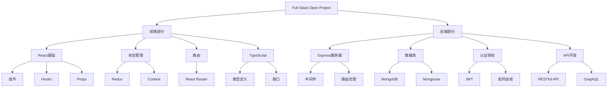
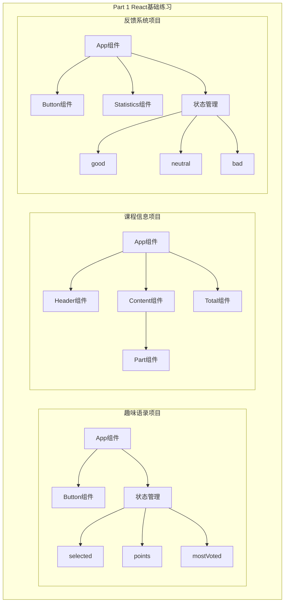
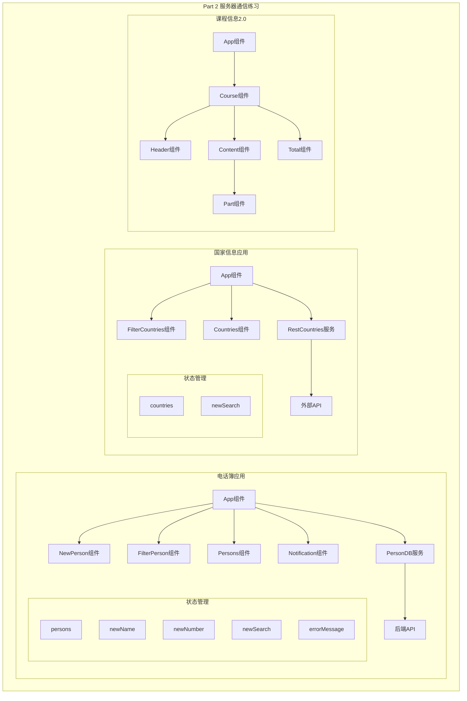

# Full Stack Open 课程项目

## 项目概述

这是 [Full Stack Open](https://fullstackopen.com/en/) 课程的练习项目集合，涵盖了现代 Web 应用开发的全过程。项目采用 React、Node.js、MongoDB 等主流技术栈，按照循序渐进的方式，从基础到高级逐步展开。

## 技术栈

### 前端技术

- React 16.8+ (支持 Hooks 特性)
- Redux (状态管理)
- React Router (路由管理)
- Axios (HTTP 客户端)
- TypeScript
- Semantic UI React (UI组件库)
- Jest & React Testing Library (测试)

### 后端技术

- Node.js
- Express
- MongoDB
- Mongoose (ODM)
- JWT (认证)
- TypeScript
- Jest (测试)

### 开发工具

- ESLint (代码规范)
- Nodemon (开发热重载)
- Cross-env (环境变量管理)
- TypeScript 工具链

## 项目结构



## 项目部分说明

1. **Part 0: Web 应用基础**

   - Web 应用的基本概念
   - HTTP 协议
   - HTML & CSS
   - 单页应用原理
2. **Part 1: React 基础**

   - 组件
   - Props
   - State
   - 事件处理
3. **Part 2: 与服务器通信**

   - REST API
   - Axios
   - Promise & Async/Await
   - 表单处理
4. **Part 3: Node.js 后端**

   - Express
   - MongoDB
   - 错误处理
   - 配置管理
5. **Part 4: 测试与用户认证**

   - 单元测试
   - 集成测试
   - 用户认证
   - Token 认证
6. **Part 5: 前端进阶**

   - 前端测试
   - 自定义 Hooks
   - Props.children
   - 样式处理
7. **Part 6: 状态管理**

   - Redux
   - Redux Thunk
   - 通知消息
   - 状态范式化
8. **Part 7: React Router 与样式库**

   - 路由管理
   - 自定义 hooks
   - 样式库使用
   - webpack 配置
9. **Part 8: GraphQL**

   - GraphQL 基础
   - Apollo Client
   - Apollo Server
   - 数据库集成
10. **Part 9: TypeScript**

    - TypeScript 基础
    - 类型定义
    - 接口
    - 泛型

## Part 1 项目详解

### 项目架构图



### 1. Anekdootit (趣味语录)

#### 功能描述

- 显示编程相关的趣味语录
- 支持随机切换语录
- 支持对语录进行投票
- 显示得票最多的语录

#### 技术实现

- 使用 `useState` Hook 管理状态
- 组件化设计，抽象 `Button` 组件
- 事件处理：随机选择和投票功能
- 数组和对象的状态管理

#### 代码结构

```javascript
const App = props => {
  const [selected, setSelected] = useState(0);
  const [points, setPoints] = useState(new Uint8Array(6));
  const [mostVoted, setMostVoted] = useState("");
  // ... 事件处理逻辑
};
```

#### 现代化改进建议

1. 使用 TypeScript 增加类型安全
2. 使用 Context 或状态管理库处理投票数据
3. 添加持久化存储
4. 使用 CSS-in-JS 或 Styled Components
5. 添加动画效果
6. 实现响应式设计

### 2. Kurssitiedot (课程信息)

#### 功能描述

- 显示课程基本信息
- 展示课程各部分内容
- 计算练习总数

#### 技术实现

- 组件化结构设计
- Props 数据传递
- 组件复用
- 数据结构设计

#### 代码结构

```javascript
const App = () => {
  const course = {
    name: 'Half Stack -sovelluskehitys',
    parts: [
      // ... 课程数据
    ]
  };
  return (
    <div>
      <Header course={course.name} />
      <Content content={course.parts} />
      <Total total={course.parts} />
    </div>
  );
};
```

#### 现代化改进建议

1. 使用 TypeScript 定义接口
2. 实现数据获取和API集成
3. 添加路由支持多课程
4. 使用 Grid/Flexbox 优化布局
5. 实现响应式设计
6. 添加课程搜索和筛选功能

### 3. Unicafe (反馈系统)

#### 功能描述

- 收集用户反馈（好评、中评、差评）
- 计算统计数据
- 显示反馈统计结果

#### 技术实现

- 使用 `useState` Hook 管理状态
- 条件渲染
- 组件复用
- 统计计算逻辑

#### 代码结构

```javascript
const App = () => {
  const [good, setGood] = useState(0);
  const [neutral, setNeutral] = useState(0);
  const [bad, setBad] = useState(0);
  // ... 事件处理和渲染逻辑
};
```

#### 现代化改进建议

1. 使用 TypeScript 增加类型安全
2. 使用 Redux Toolkit 管理状态
3. 实现数据持久化
4. 添加用户认证
5. 实现数据可视化
6. 添加更多统计指标
7. 支持自定义反馈类型

### 技术债务与改进

1. **状态管理**

   - 当前：简单的 useState
   - 建议：使用 Redux Toolkit 或 Zustand
   - 原因：更好的状态管理和开发体验
2. **类型系统**

   - 当前：普通 JavaScript
   - 建议：迁移到 TypeScript
   - 原因：提高代码质量和可维护性
3. **样式方案**

   - 当前：简单的 CSS
   - 建议：使用 Styled Components 或 Tailwind
   - 原因：更好的样式管理和主题支持
4. **构建工具**

   - 当前：Create React App
   - 建议：迁移到 Vite
   - 原因：更快的开发体验
5. **测试覆盖**

   - 当前：缺少测试
   - 建议：添加单元测试和集成测试
   - 原因：保证代码质量
6. **性能优化**

   - 当前：基础实现
   - 建议：添加性能优化
   - 原因：提升用户体验

### 开发最佳实践

1. **代码组织**

   - 实现组件化
   - 遵循单一职责原则
   - 使用 Custom Hooks 抽象逻辑
2. **状态管理**

   - 合理使用状态提升
   - 避免过度的状态管理
   - 使用 Context 共享状态
3. **性能优化**

   - 使用 React.memo 优化渲染
   - 实现懒加载
   - 优化依赖项
4. **可维护性**

   - 添加适当的注释
   - 实现错误边界
   - 使用 PropTypes 或 TypeScript

## 技术演进与现代化建议

### 需要更新的技术点

1. **React 版本升级**

   - 当前使用 React 16.8.6
   - 建议升级到 React 18+，以支持并发特性
   - 使用新的 Suspense 和 Streaming SSR 特性
2. **状态管理方案**

   - 当前使用 Redux
   - 可考虑使用 Redux Toolkit
   - 或迁移到 Zustand、Jotai 等轻量级方案
3. **构建工具**

   - 当前使用 Create React App
   - 建议迁移到 Vite 或 Next.js
   - 提升开发体验和构建性能
4. **UI 框架**

   - 当前使用 Semantic UI React
   - 可考虑迁移到 Tailwind CSS
   - 或使用 Chakra UI、MUI v5 等现代组件库
5. **API 层**

   - 考虑使用 tRPC 或 GraphQL
   - 引入 API 类型安全
   - 使用 React Query/SWR 进行数据获取
6. **后端架构**

   - 引入依赖注入
   - 使用 Prisma 等现代 ORM
   - 采用领域驱动设计

### 新技术建议

1. **前端**

   - 使用 React Server Components
   - 采用 Streaming SSR
   - 引入 Edge Runtime
   - 使用 Islands Architecture
2. **后端**

   - 使用 Fastify 替代 Express
   - 采用 Edge Functions
   - 使用 Serverless 架构
   - 引入 WebSocket 支持
3. **数据库**

   - 考虑使用 PostgreSQL
   - 引入数据库迁移工具
   - 使用连接池优化
4. **开发体验**

   - 使用 pnpm 作为包管理器
   - 采用 Monorepo 架构
   - 使用 Turborepo 优化构建
   - 引入 Changesets 管理版本
5. **部署**

   - 使用容器化部署
   - 采用 CI/CD 自动化
   - 使用 Infrastructure as Code
   - 考虑使用 Kubernetes

## 使用说明

1. 克隆项目

```bash
git clone <repository-url>
cd fullstackopen
```

2. 安装依赖

```bash
# 前端项目
cd part_X/project-name
npm install

# 后端项目
cd part_X/project-name
npm install
```

3. 运行开发服务器

```bash
# 前端项目
npm start

# 后端项目
npm run dev
```

4. 运行测试

```bash
npm test
```

5. 构建生产版本

```bash
npm run build
```

## 注意事项

1. 确保已安装 Node.js 14+ 版本
2. 部分项目需要设置环境变量，请参考 `.env.example` 文件
3. MongoDB 项目需要有可用的数据库连接
4. TypeScript 项目需要额外的编译步骤

## 贡献指南

1. Fork 项目
2. 创建特性分支
3. 提交改动
4. 发起 Pull Request

## 许可证

MIT License

## Part 2 项目详解

### 项目架构图



### 1. Puhelinluettelo (电话簿应用)

#### 功能描述

- 联系人管理系统
- 支持添加、删除、更新联系人
- 实时搜索过滤
- 错误提示和操作反馈
- 数据持久化存储

#### 技术实现

- React Hooks 状态管理
- Axios 处理 HTTP 请求
- RESTful API 接口
- 组件化架构
- 错误边界处理
- JSON Server 模拟后端

#### 代码结构

```javascript
const App = () => {
  const [persons, setPersons] = useState([]);
  const [newName, setNewName] = useState("");
  const [newNumber, setNewNumber] = useState("");
  const [newSearch, setNewSearch] = useState("");
  const [errorMessage, setErrorMessage] = useState(null);

  // CRUD 操作实现
  const addPerson = (event) => {
    // ... 添加联系人逻辑
  };

  const handleDeletePerson = (name, id) => {
    // ... 删除联系人逻辑
  };

  // 副作用处理
  useEffect(() => {
    // ... 数据获取逻辑
  }, []);
};
```

#### 现代化改进建议

1. 使用 React Query 处理数据获取和缓存
2. 实现乐观更新
3. 添加表单验证库
4. 使用 TypeScript 类型检查
5. 实现实时同步
6. 添加单元测试和集成测试
7. 优化性能和用户体验

### 2. Restcountries (国家信息应用)

#### 功能描述

- 国家信息查询系统
- 实时搜索过滤
- 详细信息显示
- 外部API数据获取
- 响应式设计

#### 技术实现

- React Hooks
- Axios 处理 API 请求
- 条件渲染
- 数据过滤
- 组件复用

#### 代码结构

```javascript
function App() {
  const [newSearch, setNewSearch] = useState("");
  const [countries, setCountries] = useState([]);

  useEffect(() => {
    // ... 获取国家数据
  }, []);

  return (
    <div>
      <FilterCountries
        newSearch={newSearch}
        handleSearchChange={handleSearchChange}
      />
      <Countries countries={countries} newSearch={newSearch} />
    </div>
  );
}
```

#### 现代化改进建议

1. 使用 SWR 或 React Query 处理数据获取
2. 实现数据缓存策略
3. 添加错误处理和加载状态
4. 优化搜索性能
5. 实现离线支持
6. 添加地图集成
7. 支持多语言

### 3. Kurssitiedot 2.0 (课程信息升级版)

#### 功能描述

- 课程信息展示系统
- 组件化结构
- 数据聚合计算
- 可扩展设计

#### 技术实现

- 组件抽象和复用
- Props 数据传递
- 函数式编程
- 模块化设计

#### 代码结构

```javascript
const Course = ({ course }) => {
  return (
    <div>
      <Header name={course.name} />
      <Content parts={course.parts} />
      <Total parts={course.parts} />
    </div>
  );
};
```

#### 现代化改进建议

1. 使用 TypeScript 定义接口
2. 实现数据获取和API集成
3. 添加状态管理
4. 优化性能
5. 实现动态主题
6. 添加动画效果

### Part 2 技术债务与改进

1. **数据获取**

   - 当前：简单的 Axios 请求
   - 建议：使用 React Query/SWR
   - 原因：更好的缓存和状态管理
2. **错误处理**

   - 当前：基础的错误提示
   - 建议：全局错误边界
   - 原因：更健壮的错误处理
3. **性能优化**

   - 当前：基础渲染
   - 建议：实现虚拟列表
   - 原因：处理大量数据
4. **用户体验**

   - 当前：基础交互
   - 建议：添加加载状态和过渡动画
   - 原因：提升用户体验
5. **代码质量**

   - 当前：JavaScript
   - 建议：迁移到 TypeScript
   - 原因：提高代码可维护性

### Part 2 最佳实践

1. **数据获取**

   ```javascript
   // 改进前
   useEffect(() => {
     axios.get('/api/data').then(response => setData(response.data));
   }, []);

   // 改进后
   const { data, error, isLoading } = useQuery('data', fetchData);
   ```
2. **错误处理**

   ```javascript
   // 改进前
   .catch(error => setError(error.message));

   // 改进后
   const ErrorBoundary = ({ children }) => {
     // ... 实现错误边界
   };
   ```
3. **性能优化**

   ```javascript
   // 改进前
   {items.map(item => <Item key={item.id} {...item} />)}

   // 改进后
   <VirtualList
     data={items}
     renderItem={item => <Item {...item} />}
   />
   ```
4. **组件设计**

   ```javascript
   // 改进前
   const Component = (props) => {
     // ... 大量逻辑
   };

   // 改进后
   const useCustomHook = () => {
     // ... 抽离逻辑
   };
   ```
